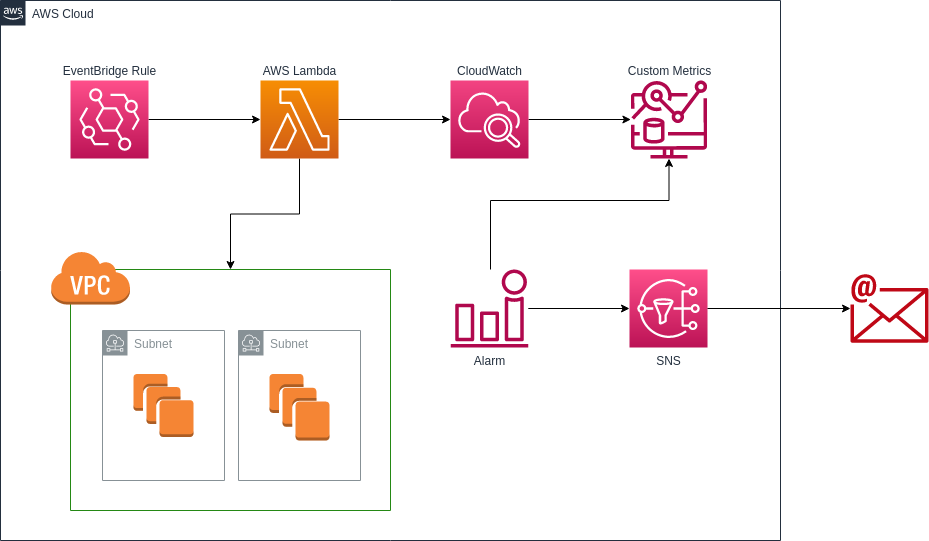

# aws-available-ip-monitor-cdk

The ips are not infinite inside on a subnet and in AWS is not different, if you have a small subnet in your VPC and 
dont has available ips you can't deploy resources on this subnet, this can be tracked with this monitor and set a 
threshold to send a notification for everybody involved with this.

This CDK stack deploy all resources to track available ips for every subnet in all or selected VPC (by config), 
scheduled Lambda with a rule from EventBridge and send custom metrics to CloudWatch for storage and feed the alarms to 
send notification to SNS when the threshold is reached.



## Dependencies

- node 16 and npm
- python 3.7+
- AWS Account to deploy

## Install

- Create a python environment and activate `virtualenv .venv | source .venv/bin/activate`
- Install python requirements `pip install -r requirements.txt`
- Install npm packages `npm install`

<sup>*If the AWS account are new or never deploy a CDK stack need run the command `cdk bootstrap` to prepare the account for deploy with CDK</sup>

## Config

On the `context` in the `cdk.json` can you set this options

- `vpcs`: the list fo all `VPC` to track their `subnets`. 
  - options:
    - "vpc-01e52581bab413b49,vpc-01e52581bab413b49" separated by comma
    - "all"
- `emailSubscription`: the email for send notifications separated by comma.
- `alarmThreshold`: the threshold to send the notifications.

**Example**

```json
...
"context": {
    "vpcs": "all",
    "emailSubscription": "email@email.com",
    "alarmThreshold": 50
  }
...
```

#### Deploy `cdk deploy`

#### Destroy `cdk destroy`
